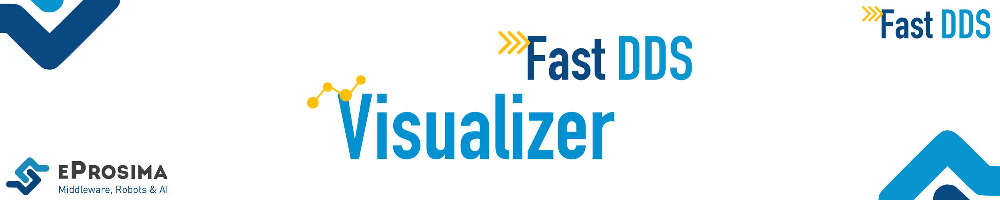

 

    <strong>
        <a href="https://eprosima.com/index.php/downloads-all">Download</a>
        &nbsp;&nbsp;•&nbsp;&nbsp;
        <a href="https://plotjuggler-fastdds-plugins.readthedocs.io/en/latest/">Docs</a>
        &nbsp;&nbsp;•&nbsp;&nbsp;
        <a href="https://eprosima.com/index.php/company-all/news">News</a>
        &nbsp;&nbsp;•&nbsp;&nbsp;
        <a href="https://x.com/EProsima">X</a>
        &nbsp;&nbsp;•&nbsp;&nbsp;
        <a href="mailto:info@eprosima.com">Contact Us</a>
    </strong>

  

    
    
    
    
    
    

  

*eProsima Fast DDS Visualizer Plugin* is a plugin for the *PlotJuggler* application.
PlotJuggler is a graphical desktop application providing visualization features
of data series, time series, X-Y plots.
It also adds data management features, such as
data import and export, custom and built-in data manipulation functions,
data series merges, etc.
Also, this software supports many different layouts, with dynamic, rich and user-friendly customization.

*Fast DDS Visualizer Plugin* allows users to visualize topic-related data from a DDS network.
The user can select several topics from the discovered topics running in the DDS network.
These topics will be divided by values using data type introspection,
and each value could be visualized and managed separately, allowing the user to quickly visualize
in different ways the detailed data content that is being
exchanged in the network.

*eProsima Fast DDS Visualizer Plugin* supports the following features:

1. **Data type introspection**: by using *Fast DDS Dynamic Types*,
   this plugin allows to discover the data type of the topic,
    and to visualize the data content using the corresponding data type.
1. **DDS Configurations**: Different configurations can be set to choose the *Domain Id* and to
   select specific *DDS Topics* to be visualized.
1. **All PlotJuggler features**: This plugin composes nicely with all the PlotJuggler features,
   so that users can create rich graphs from sophisticated data manipulations.

## Commercial support

Looking for commercial support? Write us to info@eprosima.com

Find more about us at [eProsima’s webpage](https://eprosima.com/).

## Documentation

You can access the documentation online, which is hosted on [Read the Docs](https://plotjuggler-fastdds-plugins.readthedocs.io/en/latest/).

* [Installation Manual](https://plotjuggler-fastdds-plugins.readthedocs.io/en/latest/rst/installation/linux.html)
* [Getting Started](https://plotjuggler-fastdds-plugins.readthedocs.io/en/latest/rst/getting_started/tutorial.html)
* [User Manual](https://plotjuggler-fastdds-plugins.readthedocs.io/en/latest/rst/user_manual/start_plugin.html)
* [Developer Manual](https://plotjuggler-fastdds-plugins.readthedocs.io/en/latest/rst/developer_manual/installation/sources/linux.html)
* [Release Notes](https://plotjuggler-fastdds-plugins.readthedocs.io/en/latest/rst/notes/notes.html)
